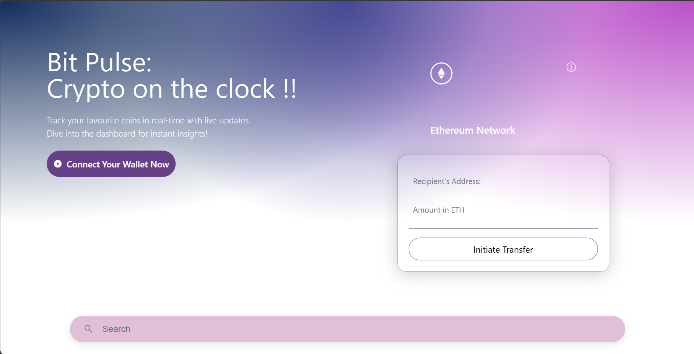

# BitPulse


## Setup and Run
Clone the repository, then run:
```bash
npm install
npm run dev
```

I have made the project using the Sepolia ETH testnet. Because of the inactivity of other servers. 
## Prerequisites
1. Existence of a Metamask wallet
2.  Sepolia ETH (testnet tokens)
3.  **Node.js**:
Node.js is essential for running the development server and managing packages with NPM, like React, Web3.js, and Hardhat.

4. **Hardhat**:
Hardhat is used for compiling, deploying, and testing smart contracts.

### In our DApp:
- **Node.js:** Runs the server and manages dependencies.
- **Hardhat:** Deploys the `Transactions` smart contract, allows local testing, and ensures correct functionality with tools like Chai.

## Deploy Smart Contract

1. **Navigate to Contracts Directory:**
   ```bash
   cd path/to/your/project/contracts
   ```

2. **Edit `transactions.sol`:**
   it can be customized as needed.

3. **Deploy with Hardhat:**
   ```bash
   npx hardhat run scripts/deploy.js
   ```
   This script compiles and deploys your smart contract to Ethereum.

## Run the DApp

1. **Navigate to src Directory:**
   ```bash
   cd path/to/your/project/src
   ```

2. **Start Local Server:**
   ```bash
   npm start
   ```
   Visit `http://localhost:3000` in your browser to interact with the DApp.

## Technologies Used
- Solidity
- Hardhat
- React
- Web3.js
- Chai
- Ethers.js
- HTML/CSS

## Design Choices

### Smart Contract Structure
- **Transaction Data:** Organized with `TransferStruct` to manage sender, receiver, amount, message, timestamp, and keyword.
- **Event Emission:** Emits a `Transfer` event for real-time updates and historical tracking.

### Frontend Interface
- **User Interaction:** Initiates transactions and displays history.
- **React:** Ensures responsive UI with real-time updates.

### Testing
- **Chai and Hardhat:** Verify smart contract and frontend behavior to ensure reliability.
